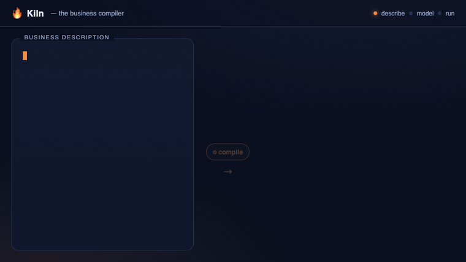

<div align="center">

# 🔥 Kiln

### The business compiler — describe a business, get the software that runs it.

[](LICENSE)
[](.github/workflows/ci.yml)
[](package.json)
[](CONTRIBUTING.md)
[](#built-and-maintained-by-claude)



<sub>↑ an animation — run Kiln yourself (below) to try it for real</sub>

[**Get started**](#get-started) · [What is Kiln?](#what-is-kiln) · [How it works](#how-it-works) · [Docs](#learn-more) · [Add an engine](docs/good-first-issues/README.md) · [Contribute](CONTRIBUTING.md)

</div>

## What is Kiln?

**Kiln turns a written description of a business into a working software starter kit.**

You describe how a business actually runs — in plain, structured language, the way you'd explain it to a
new colleague. Take a solar installer: it captures leads, surveys roofs, sends quotes, orders parts,
schedules installations, invoices, and services what it sold. You just write that down.

Kiln's AI reads it and turns it into a precise **model** of the business: the things it keeps track of
(leads, offers, work orders), the actions it takes (qualify a lead, approve an order), the events those
cause, who is allowed to do what, and which steps happen automatically. Deterministic checkers catch gaps
and contradictions along the way — and **you review and correct the AI at every step**. The AI proposes;
you decide.

Crucially, **the written description stays the single source of truth.** The diagrams and the generated
code are just *views* of it — change the words, regenerate the views. Nothing important lives in the
picture.

Then, with one click, Kiln **generates the actual software scaffolding** for that business: a database, a
web admin interface, automation workflows, connectors to tools like Excel, an agent runtime, and
documentation — a real, runnable, docker-ready project that a developer (or a coding AI) can pick up and
finish.

Think of it as **compiling a business the way you compile source code**: you write the high-level intent
once, and it produces the technical foundation — instead of a developer hand-translating a specification
into code, guessing at the details, and drifting from what the business people actually meant.

## Why "Kiln"?

A **kiln** (pronounced *"kill"*, the *n* often silent) is the oven a potter fires raw clay in to turn it
into something solid and permanent — pottery, bricks, porcelain. You put in something soft and shapeless;
heat transforms it into something hard and real.

That is the whole metaphor: you put in **soft raw material** (a plain-language description of a business)
and Kiln **fires it into something solid** (running software). It is the same idea as a *compiler* — raw
input becomes a finished artifact — with a craftsman's feel to it. (A nice accident: a kiln fires *clay*,
and [Claude](https://claude.com/claude-code) — which designs and maintains Kiln — has a clay-colored
brand.)

## How it works

```
describe            →   model (reviewed)                    →   run
plain-language          capabilities · business areas ·         PostgreSQL/SQLite · command API ·
narrative,              entities · commands/events ·            n8n · Odoo · shadcn/ui · agents ·
transcript, or          policies · roles · workflows ·         docker-compose — a complete,
agent interview         agents  (validated + human-edited)     git-initialized repo
```

Content enters three ways — paste a **transcript**, let the **agent interview** you, or **write it**
directly — and the same pipeline derives the model. The projection is deterministic; the **engines are
pluggable** (add a store, orchestrator, UI, or platform by registering one adapter — see
[SPEC-010](docs/specs/SPEC-010-engine-plugin-seam.md)).

## Get started

Set up your own Kiln in a couple of minutes. **It works fully offline in "mock" mode with no API key** —
add a key only when you want real AI generation.

**Prerequisites:** [Node ≥ 20](https://nodejs.org) and `git`. *(Optional: [Docker](https://www.docker.com)
to run a generated system; an [Anthropic API key](https://console.anthropic.com) for real AI generation.)*

**1 — Clone & install**

```bash
git clone https://github.com/ziffr/kiln.git
cd kiln
./kiln.sh install      # links the workspaces (offline; no registry fetch needed)
./kiln.sh doctor       # checks Node, .env, Docker, git
```

**2 — Run it (offline mock mode — no key needed)**

```bash
./kiln.sh dev          # service on :8787 + web app on http://localhost:5188
```

Open **http://localhost:5188**. Explore the example businesses, walk every stage (capabilities → entities
→ behaviour → … → code), preview the generated code, and export a full-stack repo — all without an API key.

**3 — Turn on real AI generation (optional — spends *your* Anthropic credits)**

Create a git-ignored `.env` in the repo root with your key, then restart:

```bash
echo 'KILN_ANTHROPIC_API_KEY=sk-ant-...' > .env
./kiln.sh dev
```

Now **Generate with LLM** derives a real model from your own text. Each call runs on *your* Anthropic
account; the app shows a per-call cost estimate. (No key? Everything above still works in mock mode.)

**4 — Generate & run a real system (optional — needs Docker)**

```bash
./kiln.sh export       # project the model → a complete multi-backend repo in ./out/targets
./kiln.sh app:up       # build + run it: Postgres + n8n + Odoo + the API + the UI (docker compose)
```

**Tests & every command**

```bash
./kiln.sh check        # the CI gate: package tests + web build
./kiln.sh help         # every command, documented
```

> **Is there a hosted demo?** Not a public one — on purpose. A hosted instance holds an Anthropic key, and
> every "Generate" would spend the operator's credits, so we don't expose a public token-spending demo.
> Run your own (above): it's a two-minute setup and needs no key to explore.

## Built and maintained by Claude

Kiln is **designed, written, tested, documented, and maintained end-to-end by [Claude](https://claude.com/claude-code)**
(Anthropic's AI) — working with a **non-technical product owner** who sets the vision, priorities, and
scope. The human decides *what* to build and *why*; the AI does the *how*.

That's true of the ongoing project too, not just the initial build:

- **Every commit** is co-authored by Claude (check the git history — `Co-Authored-By: Claude`).
- **Every pull request** is reviewed and merged by the AI maintainer; **green CI is required**, and the
  owner is consulted only on product/scope, in plain language. See **[GOVERNANCE.md](GOVERNANCE.md)**.
- **Releases** are cut automatically ([release-please](RELEASING.md)); you can even mention **`@claude`**
  on an issue to have the AI draft a fix as a normal, reviewed PR.

We're deliberately open about this. Kiln's whole premise is that you can describe intent in plain language
and get real, working software — so it would be strange to hide that Kiln itself is made that way. It's
the thesis, applied to itself.

## Examples

The app opens on a gallery of worked verticals, each demonstrating a different way in:

| Vertical | How it was captured |
|---|---|
| ☀️ **Sonnenkraft Solar** — residential & commercial solar installer | owner-written narrative (ships a fully-baked model) |
| ⚖️ **Kanzlei Berger** — commercial law firm | an uploaded **Zoom-call transcript** |
| ☕ **Röstwerk** — specialty-coffee **franchise** | a **structured interview** run by the agent |
| ⚰️ **Abschied & Würde** — funeral-service **franchise** | owner-entered content |

## Learn more

| I want to… | Read |
|---|---|
| See all specs, ADRs, and design docs | [`docs/INDEX.md`](docs/INDEX.md) |
| Contribute (setup, invariants, workflow) | [`CONTRIBUTING.md`](CONTRIBUTING.md) |
| Understand how the project is run (AI-maintained) | [`GOVERNANCE.md`](GOVERNANCE.md) |
| Add a new backend engine (store / orchestrator / UI / platform) | [`SPEC-010`](docs/specs/SPEC-010-engine-plugin-seam.md) · [good first issues](docs/good-first-issues/README.md) |
| Deploy a *generated* system | [`DEPLOY.md`](DEPLOY.md) |
| Report a security issue | [`SECURITY.md`](SECURITY.md) |
| Read the deep internal operating manual | [`CLAUDE.md`](CLAUDE.md) |
| See every CLI command | `./kiln.sh help` |

## Repository layout

```
docs/                 governed plans, specs, reviews, ADRs (see docs/CONVENTIONS.md)
packages/
  ir/                 @kiln/ir — IR types + isomorphic hashing (the spine)
  schema/             @kiln/schema — JSON Schemas
  compiler/           @kiln/compiler — authored artifacts → IR
  validation/         @kiln/validation — deterministic validators
  narrative/          @kiln/narrative — Business Narrative parser
  skills/             @kiln/skills — LLM skill runtime (generators, prompts, mock provider)
  codegen/            @kiln/codegen — model → multi-backend code (engines, exporter, full-stack)
  eval/               @kiln/eval — seeded-defect + generation-coverage scoring
  store/              @kiln/store — server-only derived cache (ADR-002)
apps/
  web/                @kiln/web — React + Vite SPA (the interactive Capability Map + stages)
  service/            @kiln/service — server-side API that holds the LLM key (@anthropic-ai/sdk)
workspaces/           reference example data
```

> **Naming.** Everything is **Kiln** — the product, the `@kiln/*` packages, and the `kiln.sh` CLI. The only
> pre-Kiln remnants are the local git-directory name (`VerticalBusinessDesiger`, kept for history) and an
> accepted legacy `VBD_ANTHROPIC_API_KEY` env alias, so existing setups keep working.

## License

[Apache-2.0](LICENSE) · © 2026 Stefan Sonntag and the Kiln contributors.
